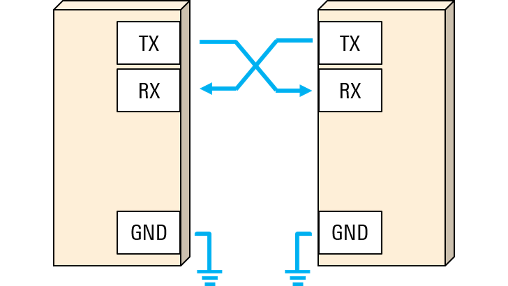
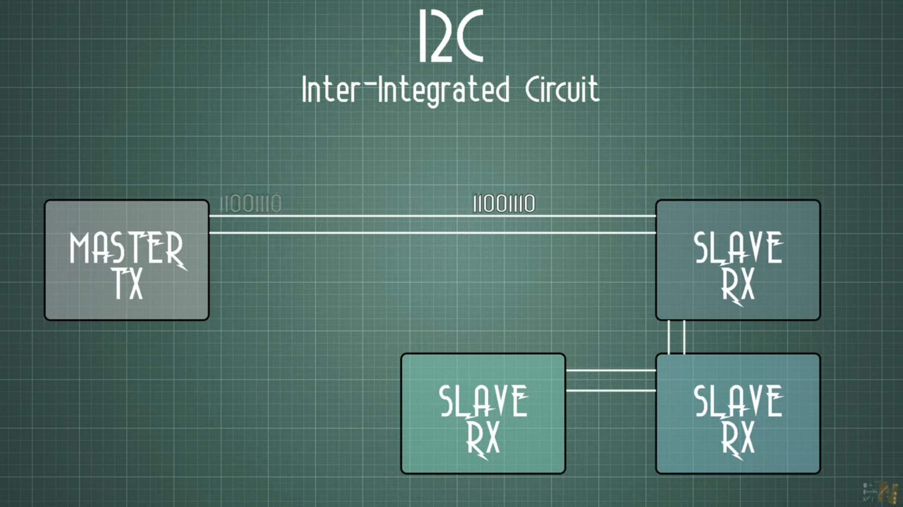
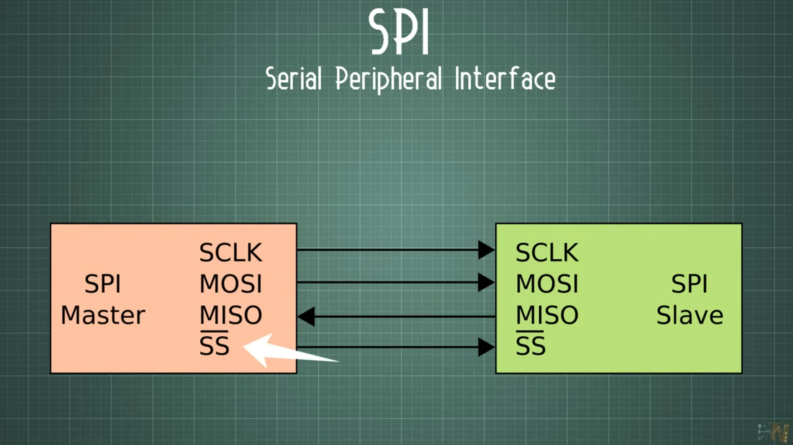
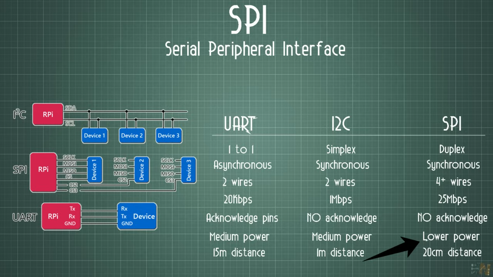
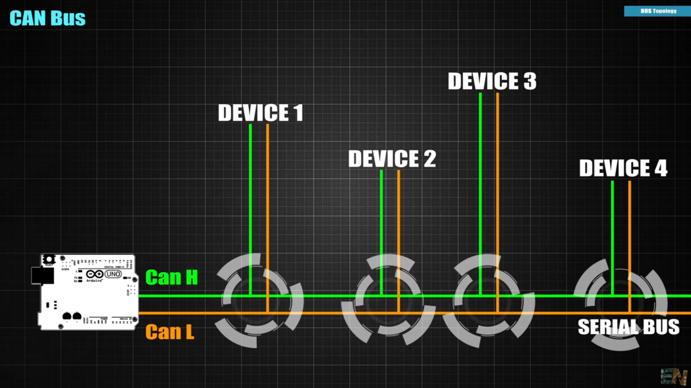
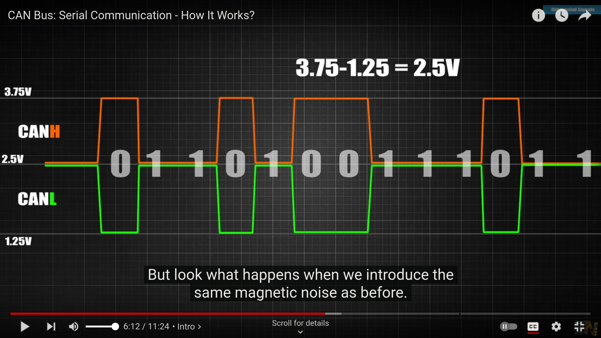

# Definition
A communication protocol is a system of rules that allows two or more entities of a communications system to transmit information via any variation of a physical quantity. The protocol defines the rules, syntax, semantics, and synchronization of communication and possible error recovery methods. Protocols may be implemented by hardware, software, or a combination of both.

# Network Protocols
## TCP/IP

# Embedded Developement Protocols(Serial Communications)
## UART 
Universal Asynchronous Receiver-Transmitter
* One TX or RX Wire
* Gound Reference

Communication Configure or we don't know how to distinguish bits without clock pulse
* transmission speed
    set the speed in bouts per second; Take 9600 bouts per second for example. That means the length of 1 bit is 1 divided by 9600 second-104us
* Data length
    the data only have 8 bits
* start and stop bits
    the signals are usually high so the first LOW is the start bit
    after counting 8 bits, then stop bit

## I2C 
Inter-integrated Circuit is a synchronous, multi-master, multi-slave, packet-switched, single end-end, serial computer bus invented by Philips Semiconductor; It is widely used for attaching lower-speed peripheral to processors and micro-controllers in short-distance.

two wires and Gound Reference
* SDA-send the data
* SCL-the clock(synchronous)

we need to specify the data length and frequency
* data length-usually 16 bits
* frequency-400kilobits per second

 
At first Master will send the specific Slave Address, only the Slave will store the data into the buffer; So one transmitter and multi-receiver

## SPI 
Serial Peripheral Interface

MOSI-Master output Slave input

MISO-Master input Slave output

$\bar{SS}$ -chip select, set it low to enable data transmission

The advantage of SPI is that we can both transmit and receive data between master and slave.

No Acknowledge means even there is no slave, the master still send the data;

## CAN Bus
controller Area Network

[CAN Tutorial](https://www.youtube.com/watch?v=JZSCzRT9TTo)

In a Network, we have multiple devices connected together

* Bus Topology(All devices can send the data to each other, No master-slave)
* Half Duplex(Device take turns to transmit and receive)
* Asynchronous
* Differential Signal
* CRC(Cyclic reboundary check)

CAN has two pins CAN-High and CAN-Low

CAN use the difference between CANH and CANL to eliminate the noise

